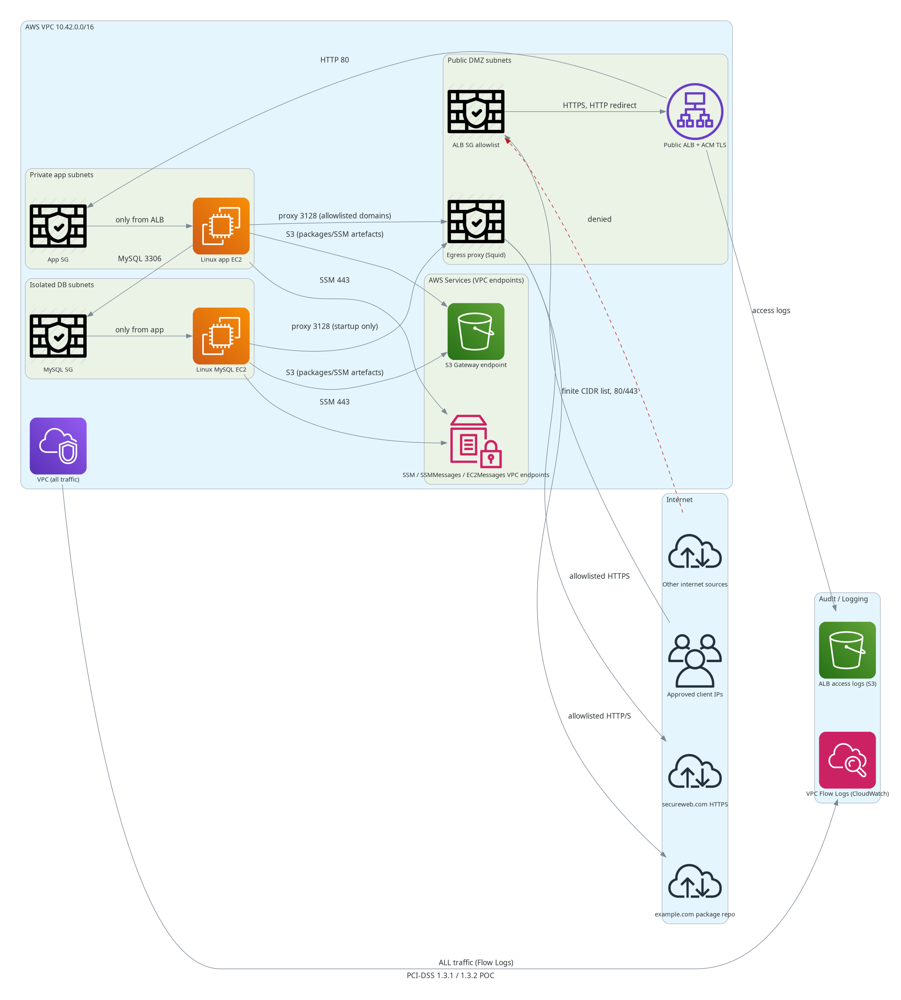

# DevOps Task - PCI-DSS Network POC

Terraform POC for the DevOps take-home assignment (task 00000010). The design addresses
PCI-DSS 1.3.1 (inbound CDE traffic restricted to necessary traffic only) and 1.3.2
(outbound CDE traffic restricted to necessary traffic only) by separating components
into three network tiers, restricting all inbound to a finite CIDR allowlist, and
forcing all outbound through a controlled egress proxy with an explicit hostname allowlist.

## Architecture



### Traffic flow

| Direction | Path | Controls |
|-----------|------|----------|
| Inbound | Approved CIDRs → ALB (443/80) | ALB SG source CIDR allowlist |
| Inbound | ALB → App EC2 (80) | App SG allows only ALB SG |
| Internal | App EC2 → MySQL EC2 (3306) | MySQL SG allows only App SG |
| Outbound | App/MySQL EC2 → internet | Forced through Squid proxy; proxy allowlists `example.com`, `secureweb.com`, and OS package repos only |
| Management | App/MySQL EC2 → SSM | VPC interface endpoints (stays inside AWS network, no internet path) |
| AWS services | App/MySQL EC2 → S3 | Gateway endpoint route plus S3 prefix-list SG egress; no NAT/default internet route |
| Logging | VPC → CloudWatch Logs | VPC Flow Logs (all traffic) |
| Logging | ALB → S3 | ALB access logs |

### Why three tiers

- **Public DMZ** — ALB and egress proxy only. Has an internet route.
- **Private app** — App EC2. No default internet route; outbound only via proxy or VPC endpoints.
- **Isolated DB** — MySQL EC2. No default internet route; outbound only via proxy (startup) or VPC endpoints (SSM).

## Files

```
*.tf                             Terraform modules
  main.tf                        VPC, subnets, route tables, IGW
  security_groups.tf             ALB, app, MySQL, egress-proxy, VPC-endpoint SGs
  ec2.tf                         App, MySQL, egress-proxy EC2 instances
  load_balancer.tf               ALB, target group, HTTPS listener, HTTP→HTTPS redirect
  iam.tf                         SSM instance profile for all EC2s
  vpc_endpoints.tf               SSM interface endpoints + S3 gateway endpoint
  logging.tf                     VPC Flow Logs (CloudWatch), ALB access logs (S3)
  variables.tf                   All input variables with descriptions and defaults
  outputs.tf                     Key outputs (ALB DNS, log group, endpoint IDs, …)
  versions.tf                    Provider constraints

templates/
  app-user-data.sh.tftpl         Configures proxy env, installs startup package, runs app
  mysql-user-data.sh.tftpl       Installs MariaDB via proxy, starts service
  proxy-user-data.sh.tftpl       Installs Squid, writes domain-allowlist squid.conf

diagrams/
  pci-poc-architecture.yaml      Spec source for diagram generator
  pci-poc-architecture.svg       Architecture diagram (SVG)
  pci-poc-architecture.png       Architecture diagram (PNG)

docs/
  audit_fallback.md              Five-day compensating controls plan for the imminent audit
  poc_discussion.md              Discussion notes, production improvements, questions for Tomasz
```

## Usage

Copy `terraform.tfvars.example` to `terraform.tfvars` and set:

```hcl
acm_certificate_arn   = "arn:aws:acm:us-east-1:ACCOUNT:certificate/CERT-ID"
allowed_ingress_cidrs = ["<client-ip-1>/32", "<client-ip-2>/32"]
```

Then:

```bash
terraform init
terraform plan
terraform apply
```

## Assumptions and design decisions

| Decision | Rationale |
|----------|-----------|
| Single EC2 app instance (no ASG) | Assignment explicitly allows this for the POC |
| Squid forward proxy for egress control | Simplest auditable demonstration of PCI 1.3.2; production replacement is AWS Network Firewall |
| SSM Session Manager, no SSH | Audit trail, no inbound port 22, no key management |
| VPC interface endpoints for SSM | Private instances cannot reach SSM via internet; endpoints keep control-plane traffic on the AWS network |
| S3 gateway endpoint | Free; keeps S3-backed SSM artefacts and approved AWS package access off the internet path for private subnets |
| MySQL proxy path at startup | POC only — production should use a pre-hardened golden AMI or private package mirror so the DB instance requires zero internet egress |
| Port 80 open on ALB | Redirect only; restricted to same finite CIDR list as 443 |
| `example.com` / `secureweb.com` | Placeholders from the assignment; replace with real approved domains |
| VPC Flow Logs + ALB access logs | Required PCI audit evidence; retained 90 days |
| ALB log bucket policy | Uses the current ELB log-delivery service principal and depends-on ordering so log validation does not race bucket-policy creation |

`allowed_ingress_cidrs` intentionally rejects `0.0.0.0/0`; use `/32` entries or
approved office/VPN CIDR ranges from Tomasz/QSA.

## Local validation

```bash
docker run --rm -v "$PWD:/workspace" -w /workspace hashicorp/terraform:1.9 fmt -recursive -check
docker run --rm -v "$PWD:/workspace" -w /workspace hashicorp/terraform:1.9 init -backend=false
docker run --rm -v "$PWD:/workspace" -w /workspace hashicorp/terraform:1.9 validate
```

All three pass cleanly. `terraform plan` and `apply` require real AWS credentials and
a valid `acm_certificate_arn`.
