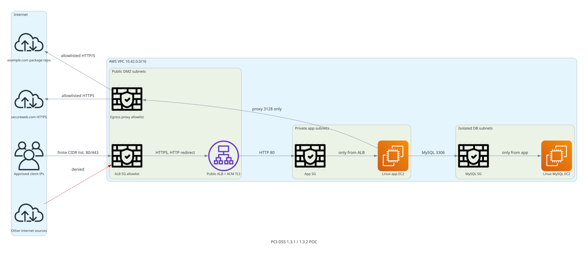

# DevOps Task - PCI-DSS Network POC

Terraform POC for the DevOps take-home assignment. The design addresses the audit gap around PCI-DSS 1.3.1 and 1.3.2 by putting the public entry point in a DMZ, restricting inbound internet traffic to a finite allowlist, and removing direct internet paths to cardholder-data-environment components.

## Architecture



Traffic flow:

- Approved client CIDRs reach only the internet-facing ALB on ports 80 and 443.
- HTTP is redirected to HTTPS; HTTPS uses an ACM certificate.
- The ALB forwards HTTP to the private app EC2 instance.
- The app EC2 instance reaches MySQL only on TCP 3306.
- The app subnet has no default internet route.
- Required outbound calls to `example.com` and `secureweb.com` go through a forward proxy with a hostname allowlist.
- MySQL is in isolated DB subnets and has no direct internet route.

## Files

- `*.tf` - Terraform POC for VPC, subnets, route tables, security groups, ALB, EC2, and IAM.
- `templates/` - EC2 user-data templates for app, MySQL, and the egress proxy.
- `diagrams/pci-poc-architecture.yaml` - Source spec used by the diagram generator.
- `diagrams/pci-poc-architecture.svg` - Generated architecture diagram.
- `docs/audit_fallback.md` - Five-day compensating control plan if full rollout is delayed.
- `docs/poc_discussion.md` - Discussion notes, production improvements, and questions.

## Usage

Copy `terraform.tfvars.example` to `terraform.tfvars` and replace:

- `acm_certificate_arn`
- `allowed_ingress_cidrs`
- `aws_region`, if needed

Then run:

```bash
terraform init
terraform fmt -recursive
terraform validate
terraform plan
```

## Assumptions

- The finite inbound IP list is supplied by the business, auditor, VPN provider, or customer onboarding process.
- Port 80 remains open only for HTTP-to-HTTPS redirect and is restricted to the same finite CIDR list as 443.
- `example.com` and `secureweb.com` are placeholders from the assignment and should be replaced with the real approved domains.
- The proxy is a POC control point. A production implementation should use a highly available managed firewall/proxy pattern with centralized logs.
- The assignment allows replacing ASG with a single EC2 instance, so the POC uses one app EC2 instance.

## Local validation

Validation performed locally:

```bash
docker run --rm -v "$PWD:/workspace" -w /workspace hashicorp/terraform:1.9 fmt -recursive
docker run --rm -v "$PWD:/workspace" -w /workspace hashicorp/terraform:1.9 init -backend=false
docker run --rm -v "$PWD:/workspace" -w /workspace hashicorp/terraform:1.9 validate
```

The diagram was generated with the provided `~/Workspace/diagram-generator` project.
